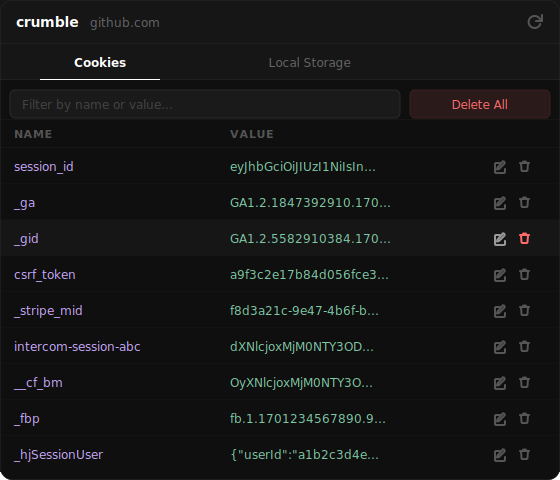

# crumble

A minimal Chrome extension for inspecting and editing cookies and local storage.

## Features

- **View** all cookies and local storage for the active tab
- **Edit** any value inline via a clean modal — includes cookie flags (Secure, HttpOnly, Session)
- **Delete** individual items with one click
- **Delete all** cookies or local storage for the domain at once
- **Filter** items by name or value in real time

## Install

1. Clone or download this repo
2. Go to `chrome://extensions`
3. Enable **Developer mode** (top-right toggle)
4. Click **Load unpacked** and select the project folder
5. Pin the extension and open it on any page

## Usage

Click the **crumble** extension icon on any tab. Switch between **Cookies** and **Local Storage** using the tabs at the top. Click the pencil icon to edit a value, the trash icon to delete it, or **Delete All** to wipe everything for that domain.

> **Note:** HttpOnly cookies can be read and deleted but their values cannot be modified — this is an intentional browser security restriction.

## Permissions

| Permission | Reason |
|---|---|
| `cookies` | Read, write, and delete cookies |
| `scripting` | Inject scripts to read/write localStorage |
| `activeTab` | Access the current tab's URL and origin |
| `host_permissions: <all_urls>` | Required for cross-origin cookie access |
